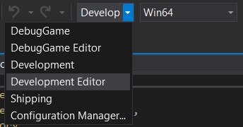
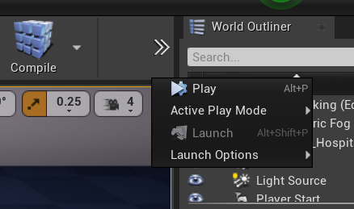
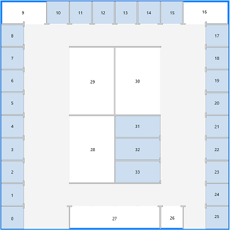

[![LinkedIn][linkedin-shield]][linkedin-url]

# Hospital of the Future - Drone navigation

<!-- PROJECT LOGO -->
<br />
<p align="center">
  <a href="https://github.com/othneildrew/Best-README-Template">
    
  </a>
  <h3 align="center">Drone Project </h3>
  <p align="center">
    A drone that can navigate through the Hospital of the Future autonomously.
  </p>
</p>

## Table of Contents

* [About the Project](#about-the-project)
  * [Technology Building Blocks](#technology-building-blocks)
* [Setup](#setup)
  * [Installing Unreal Engine](#installing-unreal-engine)
  * [Installing Visual Studio and Cloning repository](#installing-visual-studio-and-cloning-repository)
  * [Installing python and dependencies](#installing-python-and-dependencies)
* [Deployment](#deployment)
  * [Building Airsim](#building-airsim)
  * [Running the python script](#running-the-python-script)
* [Demo Video](#demo-video)


## About The Project
This project is a component of the Hospital of the Future. It leverages Microsoft Azure services to power a drone to act as a personal assistant to patients, hospital staff & visitors at Contoso Healthcare. The 3 main objectives of the drone can be classified as:

1. Autonomous navigation through the hospital facility to guide patients to different areas of the facility
2. The drone can be used for surveillance of the hospital facility. We can use its powerful sensors and camera to monitor things such as PPE and social distancing compliance for which we have created computer vision models.
3. Use the drone to help the staff locate equipment such the closest wheelchair or stretcher using asset tracking which can be enabled through the Azure Digital Twin of the hospital.


### Technology Building Blocks: 
1. [**Azure maps:**](https://docs.microsoft.com/en-us/azure/azure-maps/tutorial-creator-indoor-maps) The indoor module of azure maps is used to create a map of the entire hospital strucutre. A CAD floor plan was converted into map data which can further be queried for properties such as roomId, coordinates etc.
2. [**AirSim:**](https://github.com/microsoft/AirSim) Airsim is the drone simulator that is built on unreal engine which is used to provide a visual on how the drone would move in a real hospital environment. A 3D model of the hospital was created and imported into Unreal Engine which the drone can navigate.
3. [**Azure digital twin:**](https://azure.microsoft.com/en-us/services/digital-twins/) Using asset tracking available through the Azure digital twin, further additions such as finding the closest unoccupied room, closest wheelchair and more can be determined and fed as a destination point for the drone.

<!-- GETTING STARTED -->
## Setup
### Installing Unreal Engine
You will need to install Unreal Engine to work with this demo code using the following steps:

1. [Download](https://www.unrealengine.com/en-US/download) the Epic Games Launcher. While the Unreal Engine is open source and free to download, registration is still required.
2. Run the Epic Games Launcher, open the `Unreal Engine` tab on the left pane and then click on the `Library` tab on the top navigation bar.
3. Click on the `+` next to engine versions which should show the option to download Unreal 4.25. If you have multiple versions of Unreal installed then **make sure 4.25 is set to `current`** by clicking down arrow next to the Launch button for the version.

**Note**: AirSim also works with UE >= 4.22, however, we recommend you update to 4.25.

### Installing Visual Studio and cloning repository
* [Download](https://visualstudio.microsoft.com/downloads/) and install Visual Studio 2019.
**Make sure** to select **Desktop Development with C++** and **Windows 10 SDK 10.0.18362** (should be selected by default) while installing VS 2019.
* [Download](https://dotnet.microsoft.com/download/dotnet-framework/thank-you/net48-developer-pack-offline-installer) and install .NET Framework Developer pack >= 4.6.
* Start `Command Prompt` and change the current working directory to the location where you want the cloned directory to be made.
* Clone the drone project repo: `INSERT URL HERE`.
* Start `Developer Command Prompt for VS 2019`
* Clone the airsim repo: `git clone https://github.com/Microsoft/AirSim.git` and go the AirSim directory by `cd Airsim`
* Run `build.cmd` from the command line. This will create ready to use plugin bits in the `Unreal\Plugins` folder and drop it into the src folder of the drone project.

### Installing python and dependencies
* [Download](https://www.python.org/ftp/python/3.8.5/python-3.8.5-amd64-webinstall.exe) and install the latest version of python.
* Check the box that says `Add Python to PATH`
* Run `Command Prompt` as Administrator and change the current working directory to `src\PythonClient\multirotor`
* This package depends on `msgpack` and `airsim`. To install, copy paste this into the `Command Prompt`:
```
pip install airsim msgpack-rpc-python
```

## Deployment
### Running Airsim
Once the project is set up by following above steps, you can:
1. In the src folder, double click on Hospital.sln file to load the Contoso Healthcare environment onto Unreal Engine. 
2. Make sure Build config is set to "Development Editor" and Win64.\
 
3. Press F5 to run. This will start the Unreal Editor. 
4. In `Window/World Settings` as shown below, set the `GameMode Override` to `AirSimGameMode`:

### Running the python script
* To start simulation, press Play button on Unreal editor and select `no` on the choose vehicle popup to use quadcoptor.\
 
* Run `Command Prompt` as Administrator and change the current working directory to `src\PythonClient\multirotor`
* Run the navigation script using:
```
python pathFinder.py
```
* Enter the current location of drone and the destination of drone based on the Azure map below:


**Watch the drone navigate its way through the environment...**

**Note**: The drone spawns at the Reception which is Room 27 on the Azure Map. This should be the start location you enter when the simulation starts.

## Demo Video

Drone travelling from Reception to Room 20:

[](https://youtu.be/ryETxRl0_kw) 

## Eventual Impact
This solution can be utilized in multiple hospitals over the world to reduce workload of hospital staff and it cuts the necessity for them to do these dangerous surveillance tasks manually. As an addition to hospitals, it can also be used as a guide to help people navigate their way around places such as airports, mega stores and other large facilities. The computer vision models deployed on the drone will help contain the spread of diseases and can be further enhanced to work in public areas other than hospitals to enforce health and safety protocols.

## Contact

Rohan Deshamudre  - deshamudrerohan@outlook.com


[linkedin-shield]: https://img.shields.io/badge/-LinkedIn-black.svg?style=flat-square&logo=linkedin&colorB=555
[linkedin-url]: https://www.linkedin.com/in/rohan-deshamudre-5790aa1b0/

